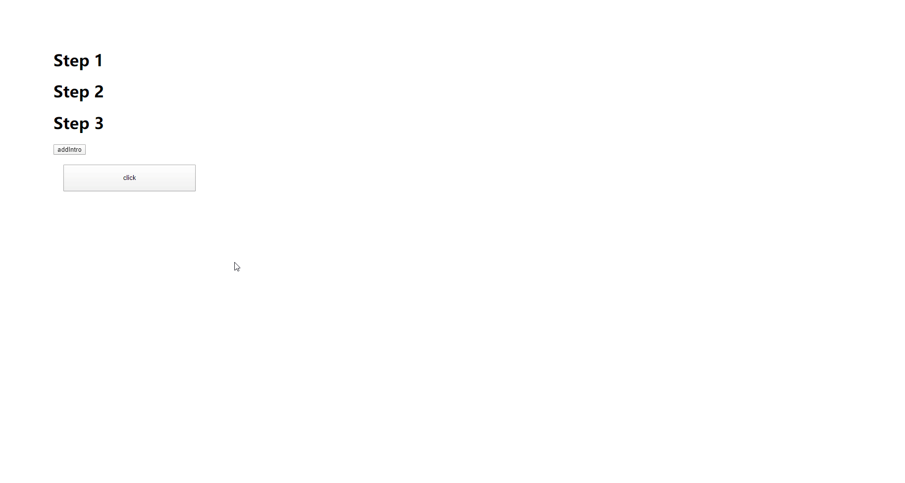

# easy-intro
Step-by-Step operation Guide.

[Example](../example/index.html)




## Install
### NPM
`npm install easy-intro -S`

### Yarn
`yarn add easy-intro -S`

## Usage
```javascript
// example.js
import { addIntro, addIntros, removeAllIntro } from "easy-intro";

// Start the introduction for single defined element
const removeIntroItem = addIntro({
  el: document.getElementById('button'),  // defined target element
  desc: 'Click Me!', // description
  realClick: true,  // Whether the target element can be clicked
  hint: true, // Show Animation
})

// remove this introduction
removeIntroItem();

// Start the introduction for defined elements.
addIntros([
  {
    el: document.getElementById('step-1'),
    desc: 'First Step! click me!',
    realClick: false,
    hint: false,
  },
  {
   el: document.getElementById('step-2'),
   desc: 'Second Step! click me!',
   realClick: false,
   hint: false,
   },
   {
   el: document.getElementById('step-3'),
   desc: 'Third Step! click me!',
   realClick: false,
   hint: false,
   }
]);

// remove All introductions
removeAllIntro();
```

## API

|    API          | param      | return   | description                                                                                      |
| ----------      | ---------- | ------   | ------------------------------------------------------------------------------------------------ |
| addIntro        | introObj   | function | add an introduction for a defined element , **the return function can be used for remove intro** |
| addIntros       | [introObj] | void     | add introduction for defined elements                                                            |
| removeAllIntro  |            | void     | remove all introductions                                                                         |
 
 The `introObj` is an Object.
 
| property  | type | default | description | 
| --------  | ---- | ------- | ----------- |
| el        | DOM element | null | defined target element  |
| desc      | String | "" | the introduction for this step |
| realClick | Boolean | true | Whether trigger the event |
| hint | Boolean | true | Add hint animation |
